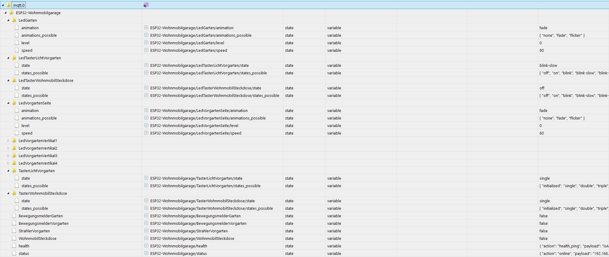

ESP32-POE MQTT actuator
==========

* This sketch was written for Olimex ESP32-POE[-ISO] using Arduino IDE.

* Various sensors or actuators can be connected to be integrated into your smart home using MQTT (which integrates easily into f.e. ioBroker using the MQTT adapter.). Thus, the logic  which sensors and switches trigger what should be made in the home automation software.

* Environment specific configuration will likely be done in setup.cpp and config.h only. More docs how to connect hardware is also there.
It should be easy to change the config to your needs, but not having a specific device at all etc. is untested as the code was written for one use case only so far. If you have questions or requests, contact me.
 
* MQTT and ETH setup based on https://github.com/zorce/ESP32-POE_MQTT_example/blob/master/ESP32-POE_MQTT.ino